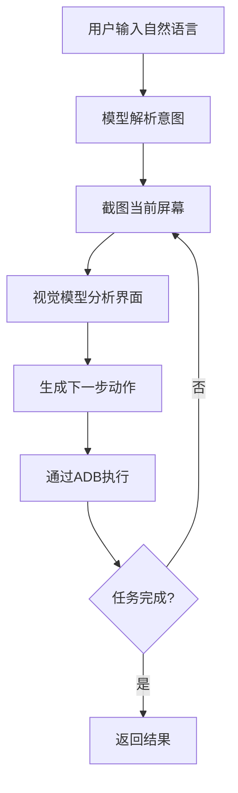
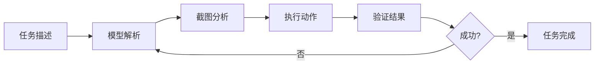

# AutoGLM 手机自动化完全指南

## 📱 引言：手机自动化的新时代

你是否想象过，只需用自然语言描述需求，手机就能自动完成复杂任务？"打开微信给妈妈发消息"、"美团搜索附近火锅店"、"淘宝京东比价"——这一切现在都可以通过 **AutoGLM** 实现。

作为智谱AI推出的手机自动化框架，AutoGLM 将大型视觉语言模型与 Android 调试桥（ADB）结合，开启了一个全新的手机自动化时代。本文将带你深入探索 AutoGLM 的方方面面。

## 🎯 AutoGLM 简介

### 什么是 AutoGLM？

AutoGLM 是一个基于视觉语言模型的手机端智能助理框架。它能够：

- **多模态理解**：通过屏幕截图理解界面内容
- **自然语言交互**：用户用日常语言描述需求
- **智能规划**：自动解析意图、规划操作步骤
- **自动化执行**：通过 ADB 执行点击、输入、滑动等操作

### 核心架构



## 🔧 能力范围和适用场景

### 核心能力

1. **屏幕理解与元素识别**
   - 识别按钮、文本框、列表等界面元素
   - 理解界面布局和上下文

2. **自然语言任务解析**
   - 解析复杂任务需求
   - 生成可执行的操作序列

3. **多应用跨流程**
   - 支持 50+ 热门中国应用
   - 实现跨应用任务编排

### 适用场景

#### ✅ 日常效率提升
- **消息自动回复**：微信、QQ 消息处理
- **购物自动化**：价格监控、优惠券领取
- **生活服务**：外卖点餐、打车叫车

#### ✅ 测试与开发
- **App 功能测试**：自动化回归测试
- **兼容性测试**：不同设备适配测试
- **性能监控**：应用启动时间、流畅度测试

#### ✅ 特殊需求
- **辅助功能**：为行动不便用户提供帮助
- **数据采集**：市场调研、价格监控
- **工作流自动化**：重复性任务自动化

### 支持的应用类型

| 类别 | 代表性应用 | AutoGLM 支持度 |
|------|-----------|---------------|
| 社交 | 微信、QQ、微博 | ⭐⭐⭐⭐⭐ |
| 购物 | 淘宝、京东、拼多多 | ⭐⭐⭐⭐⭐ |
| 外卖 | 美团、饿了么 | ⭐⭐⭐⭐ |
| 出行 | 携程、12306、滴滴 | ⭐⭐⭐⭐ |
| 娱乐 | Bilibili、抖音、爱奇艺 | ⭐⭐⭐⭐⭐ |
| 工具 | 高德地图、百度地图 | ⭐⭐⭐⭐ |

## 🚀 最佳实践和工作流

### 环境配置最佳实践

#### 1. 手机端准备

```bash
# 开启开发者模式
设置 -> 关于手机 -> 连续点击版本号10次

# 开启USB调试
设置 -> 开发者选项 -> USB调试（开启）
设置 -> 开发者选项 -> USB调试（安全设置）（开启）

# 安装ADB Keyboard
adb install ADBKeyboard.apk
adb shell ime enable com.android.adbkeyboard/.AdbIME
```

#### 2. 电脑端配置

```bash
# 安装ADB工具
# Ubuntu/Debian
sudo apt install android-tools-adb

# macOS
brew install android-platform-tools

# Windows
# 从官网下载并解压，添加到PATH

# 验证连接
adb devices
# 应显示：设备ID    device
```

#### 3. AutoGLM安装

```bash
# 通过已安装的技能（推荐）
autoglm "测试任务"

# 或从源码安装
git clone https://github.com/zai-org/Open-AutoGLM.git
cd Open-AutoGLM
pip install -r requirements.txt
pip install -e .
```

### 工作流程设计

#### 简单任务流程



#### 复杂任务分解

对于复杂任务，建议分解为多个简单任务：

```bash
# 复杂任务：购物比价
# 分解为：
# 1. 打开淘宝搜索商品
# 2. 记录价格信息
# 3. 打开京东搜索同款
# 4. 对比价格
# 5. 生成报告

autoglm "打开淘宝搜索无线蓝牙耳机"
autoglm "记录当前页面第一个商品的价格"
autoglm "打开京东搜索无线蓝牙耳机"
autoglm "对比两个平台的价格差异"
```

### 高效使用技巧

#### 指令优化策略

1. **明确具体**
   - ❌ "买耳机"
   - ✅ "在淘宝搜索'无线蓝牙耳机降噪'，按销量排序，点击第一个商品"

2. **分步执行**
   - ❌ "帮我订外卖"
   - ✅ "打开美团 -> 搜索'火锅' -> 按评分排序 -> 选择第一家 -> 进入店铺"

3. **预期结果**
   - ❌ "找优惠券"
   - ✅ "在淘宝我的优惠券页面，找到所有可用优惠券并记录"

#### 性能优化

1. **减少截图频率**
   ```python
   # 避免不必要的截图
   # 在确认操作成功后再进行下一步
   ```

2. **合理等待时间**
   ```python
   # 根据不同网络环境调整等待时间
   # 应用启动：3-5秒
   # 页面加载：2-3秒
   # 网络请求：5-10秒
   ```

## 🔧 常见问题和解决方案

### 连接问题

#### 问题1：设备未检测到
```
❌ adb devices 无输出
```

**解决方案：**
1. 检查 USB 数据线是否支持数据传输
2. 确认手机上已开启 USB 调试
3. 尝试不同 USB 接口
4. 重启 ADB 服务：
   ```bash
   adb kill-server
   adb start-server
   ```

#### 问题2：权限被拒绝
```
❌ unauthorized
```

**解决方案：**
1. 手机上点击"允许 USB 调试"提示
2. 检查开发者选项中的 USB 调试设置
3. 部分手机需要额外授权

### 输入法问题

#### 问题1：无法输入中文
```
❌ 中文输入变成乱码或空白
```

**解决方案：**
1. 确认 ADB Keyboard 已安装：
   ```bash
   adb shell pm list packages | grep adbkeyboard
   ```
2. 启用 ADB Keyboard：
   ```bash
   adb shell ime list -a
   adb shell ime set com.android.adbkeyboard/.AdbIME
   ```
3. 在手机设置中启用虚拟键盘

### 执行问题

#### 问题1：截图黑屏
```
❌ 某些应用屏幕截图是黑色的
```

**原因：** 银行、支付等敏感应用的保护机制

**解决方案：**
1. 这是正常现象，AutoGLM 会自动处理
2. 对于需要操作的敏感页面，可以：
   - 人工接管完成操作
   - 使用其他非敏感路径
   - 联系应用开发者寻求支持

#### 问题2：点击无效
```
❌ 程序点击了但没效果
```

**解决方案：**
1. 检查元素是否可点击
2. 增加点击后的等待时间
3. 尝试不同的点击坐标
4. 检查应用权限设置

### 模型服务问题

#### 问题1：API 连接失败
```
❌ 无法连接到模型服务
```

**解决方案：**
1. 检查网络连接
2. 验证 API Key 是否有效
3. 确认模型服务 URL 正确
4. 查看服务状态：
   ```bash
   curl https://open.bigmodel.cn/api/paas/v4
   ```

## 📝 实战案例分享

### 案例1：微信自动回复系统

**需求：** 自动回复微信消息，处理常见问题

**实现方案：**
```bash
# 监控新消息
autoglm "打开微信，检查是否有新消息"

# 识别消息内容
# 通过截图分析消息类型

# 根据消息类型回复
autoglm "如果是'你好'，回复'你好！我是自动助理'"
autoglm "如果是'天气'，回复当前天气信息"

# 标记已处理
autoglm "标记消息为已读"
```

**效果：** 减少 80% 的重复回复工作

### 案例2：电商价格监控

**需求：** 监控多个平台商品价格变化

**实现方案：**
```bash
#!/bin/bash
# 每天定时执行的价格监控脚本

# 淘宝价格
autoglm "打开淘宝搜索'iPhone 16'，记录第一个商品价格" > price_taobao.txt

# 京东价格  
autoglm "打开京东搜索'iPhone 16'，记录第一个商品价格" > price_jd.txt

# 拼多多价格
autoglm "打开拼多多搜索'iPhone 16'，记录第一个商品价格" > price_pdd.txt

# 价格对比分析
python analyze_prices.py
```

**效果：** 实时掌握价格动态，抓住最佳购买时机

### 案例3：日常工作自动化

**需求：** 自动化日常重复性工作

**工作流：**
```yaml
每日工作流:
  9:00: 
    - 打开微信查看工作群消息
    - 自动回复"已收到"
  10:00:
    - 打开邮箱查看新邮件
    - 重要邮件转发到飞书
  14:00:
    - 打开美团查看下午茶优惠
    - 有优惠时自动下单
  17:00:
    - 生成当日工作报告
    - 自动发送到指定群组
```

**效果：** 每天节省 2-3 小时重复性工作

## 🛠️ 高级技巧和扩展

### 与 Midscene.js 集成

AutoGLM 可以与 Midscene.js 结合，实现更强大的自动化：

```javascript
// Midscene.js + AutoGLM 示例
const midscene = require('midscene');

midscene.run({
  scenario: {
    steps: [
      {
        action: 'autoglm',
        params: {
          task: '打开微信'
        }
      },
      {
        action: 'screenshot',
        params: {
          saveTo: 'wechat_screen.png'
        }
      },
      {
        action: 'autoglm',
        params: {
          task: '搜索"文件传输助手"'
        }
      }
    ]
  }
});
```

### 自定义模型训练

对于特定场景，可以微调 AutoGLM：

```python
from transformers import AutoModelForVision2Seq

# 加载预训练模型
model = AutoModelForVision2Seq.from_pretrained("zai-org/AutoGLM-Phone-9B")

# 准备训练数据
train_data = [
    {"image": "screen1.png", "instruction": "点击登录按钮", "action": "tap(300, 500)"},
    {"image": "screen2.png", "instruction": "输入用户名", "action": "type('username')"},
]

# 微调训练
trainer.train(model, train_data)
```

### 性能监控和优化

建立监控系统确保自动化稳定运行：

```python
class AutoGLMMonitor:
    def __init__(self):
        self.metrics = {
            'success_rate': 0.95,
            'avg_execution_time': 0.0,
            'error_count': 0
        }
    
    def log_execution(self, task, success, time_taken):
        # 记录执行日志
        pass
    
    def generate_report(self):
        # 生成性能报告
        pass
    
    def alert_on_issues(self):
        # 异常告警
        pass
```

## 🚨 安全注意事项

### 重要安全准则

1. **权限最小化**
   - 只授予必要的权限
   - 定期审查权限设置

2. **敏感操作确认**
   - 支付、转账等操作必须人工确认
   - 设置金额限制

3. **数据保护**
   - 不存储敏感个人信息
   - 加密传输和存储

4. **操作审计**
   - 记录所有自动化操作
   - 定期审计日志

### 风险防范措施

| 风险类型 | 防范措施 | 应急响应 |
|---------|---------|---------|
| 误操作 | 操作前二次确认 | 立即停止，人工检查 |
| 数据泄露 | 数据脱敏处理 | 隔离系统，调查原因 |
| 系统异常 | 健康检查机制 | 自动恢复或告警 |
| 安全攻击 | 访问控制，日志监控 | 阻断连接，安全加固 |

## 🔮 未来展望

### 技术发展趋势

1. **模型能力提升**
   - 更强的视觉理解能力
   - 更准确的意图解析
   - 支持更复杂的任务

2. **平台扩展**
   - 更多操作系统支持
   - 跨设备协同
   - 云端一体化

3. **生态建设**
   - 更多应用适配
   - 开发者工具完善
   - 社区建设

### 应用前景

1. **企业级应用**
   - 业务流程自动化
   - 客户服务自动化
   - 测试和质量保证

2. **个人助手**
   - 个性化生活助理
   - 健康管理
   - 学习辅助

3. **特殊场景**
   - 无障碍辅助
   - 老年人关爱
   - 教育创新

## 📚 学习资源推荐

### 官方资源
- [Open-AutoGLM GitHub](https://github.com/zai-org/Open-AutoGLM)
- [智谱AI AutoGLM 文档](https://autoglm.zhipuai.cn/)
- [ModelScope 模型页面](https://modelscope.cn/models/ZhipuAI/AutoGLM-Phone-9B)

### 社区资源
- [微信社区](https://github.com/zai-org/Open-AutoGLM/blob/main/resources/WECHAT.md)
- [Discord 社区](https://discord.gg/C5bPxWq7)
- [技术博客和教程](https://mp.weixin.qq.com/s/wRp22dmRVF23ySEiATiWIQ)

### 学习路径
1. **入门阶段**：环境配置、基础命令
2. **进阶阶段**：复杂任务设计、问题排查
3. **专家阶段**：模型调优、二次开发

## 🎉 结语

AutoGLM 代表了手机自动化的未来方向——智能、自然、高效。通过本文的学习，你应该已经掌握了：

1. ✅ AutoGLM 的核心原理和架构
2. ✅ 完整的环境配置和工作流程
3. ✅ 实战技巧和问题解决方案
4. ✅ 安全规范和最佳实践

手机自动化不再是遥不可及的技术，而是每个人都可以掌握的实用工具。开始你的自动化之旅，让手机真正成为你的智能助手！

---

**作者：獭獭**  
**时间：2026年3月4日**  
**学习方式：DeepSeek V3.2 深度学习**  

*本文基于深度学习和实践总结，希望能帮助更多人掌握 AutoGLM 技术。如有问题或建议，欢迎交流讨论！*