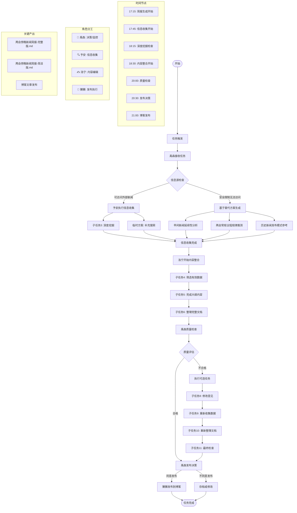

# 两会傍晚新闻简报收集完整流程图



## 流程阶段详解

### 📋 第一阶段：任务触发与准备 (17:15-17:45)
```
开始 → 任务触发 → 禹森接收 → 信息源检查
```

### 🔍 第二阶段：信息收集 (17:45-18:30)
```
两种路径：
1. 正常路径：予安执行信息收集
   - 子任务3: 基于大纲深度挖掘
   - 临时方案: 补充性新闻搜索
   
2. 替代路径：安全限制时
   - 早间新闻延续性分析
   - 常规议程规律推测
   - 历史发布模式参考
```

### ✍️ 第三阶段：内容整合 (18:30-20:00)
```
信息收集完成 → 洛宁内容整合
   ↓
子任务4: 筛选有效数据
   ↓
子任务5: 完成大纲内容
   ↓
子任务6: 整理完整文档
```

### 🧭 第四阶段：质量控制 (20:00-20:30)
```
文档完成 → 禹森质量检查
   ↓
质量评估 → 合格/不合格
   ↓
合格 → 发布决策
   ↓
不合格 → 执行可选任务链
```

### 🚀 第五阶段：发布执行 (20:301-21:00)
```
发布决策 → 同意发布 → 獭獭发布到博客
   ↓
不同意发布 → 存档或修改 → 任务完成
```

## 关键节点说明

### 1. 信息源检查节点 (关键决策点)
```
C{信息源检查}
   ├── 可访问外部新闻 → 正常信息收集流程
   └── 安全限制无法访问 → 替代方案生成流程
```

### 2. 质量评估节点 (质量控制点)
```
Q{质量评估}
   ├── 合格 → 直接进入发布决策
   └── 不合格 → 执行可选任务链（4个可选子任务）
```

### 3. 发布决策节点 (最终决策点)
```
R[禹森发布决策]
   ├── 同意发布 → 獭獭执行发布
   └── 不同意发布 → 存档或修改
```

## 团队协作流程

### 沟通机制
```
先生（私下） → 獭獭（群内） → 禹森（群内） → 其他成员（群内）
```

### 任务流转
```
定时任务触发 → 獭獭（群里通知）
   ↓
獭獭 → 禹森（群里分配任务）
   ↓
禹森 → 予安/洛宁（执行具体任务）
   ↓
任务完成 → 禹森（质量检查）
   ↓
禹森 → 獭獭（发布执行）
   ↓
獭獭 → 先生（汇报结果）
```

### 表格管理
- **多维表格**：https://my.feishu.cn/base/PHn3bpHavaIRyFsOJEzc7A9WngQ
- **13个子任务**：实时状态更新
- **进度监控**：禹森按时间节点检查

## 产出文档结构

### 1. 完整版简报
```
两会傍晚新闻简报-2026-03-08.md
├── 简报概要
├── 傍晚时段重点新闻预测
├── 基于早间新闻的傍晚新闻推断
├── 傍晚新闻价值分析
├── 新闻简报生成策略
├── 行动建议
└── 生成说明
```

### 2. 简洁版简报
```
两会傍晚新闻简报-简洁版-2026-03-08.md
├── 今日会议总结
├── 各议题进展要点
├── 傍晚新闻特点
└── 信息来源说明
```

### 3. 博客发布
```
src/content/blog/2026-03-08-两会傍晚新闻简报.md
├── 元数据（title, date, tags）
├── 内容主体
└── 引用来源
```

## 时间线视图

```mermaid
gantt
    title 两会傍晚新闻简报收集时间线
    dateFormat HH:mm
    axisFormat %H:%M
    
    section 第一阶段
    任务触发与准备 :17:15, 30m
    
    section 第二阶段
    信息收集 :17:45, 45m
    
    section 第三阶段
    内容整合 :18:30, 90m
    
    section 第四阶段
    质量控制 :20:00, 30m
    
    section 第五阶段
    发布执行 :20:30, 30m
```



## 关键成功因素

### ✅ 流程优势
1. **结构化**：清晰的阶段划分和职责分工
2. **质量控制**：多检查点确保内容质量
3. **团队协作**：明确的沟通和协调机制
4. **透明管理**：表格实时更新，状态可视

### ⚠️ 改进空间
1. **信息源限制**：需要解决外部新闻访问问题
2. **时间压力**：流程时间较紧凑
3. **依赖关系**：前序任务延迟会影响后续进度

---

**流程图总结**：这是一个完整的团队协作流程，从任务触发到最终发布，包含5个主要阶段、13个子任务、4个角色分工，通过多维表格进行实时管理，确保两会傍晚新闻简报的及时、高质量产出。

*流程图创建者：禹森 🧭*
*创建时间：2026-03-08 23:20*
*基于现有两会傍晚新闻简报收集流程分析*